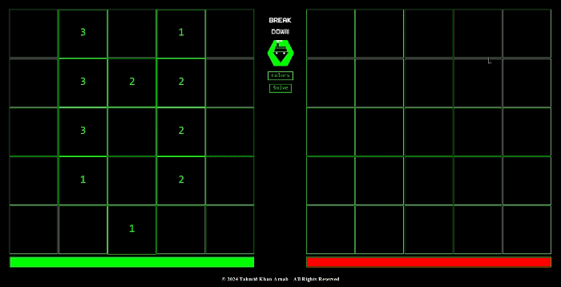

# Break Down
A classic Battleship game implemented in Java using the Swing library. Many features are included such as customization and quick solving. 
Demo:  
## Table of Contents
- [Features](#features)
- [Installation](#installation)  
- [Explanation](#explanation)  </li>

### Features
- Customizable colors through the "Colors" button.
- Solution mode that ends the game by revealing the enemy's ships, through the "Solve" button.
### Installation
- Install Java <a href="https://www.java.com/en/download/help/download_options.html" target="_blank">here</a>.
- Download and extract the [Demo.zip](Demo.zip) file.
- Run the Game.jar file located in the extracted folder.

### Explanation
This application leverages Java Swing components to create an interactive and user-friendly interface. It utilizes a JFrame to provide the main window structure, while abstracted JButtons represent individual tiles on the game board, allowing players to make selections and interact with the game. The JPanel component is used to organize and layout these buttons and other interface elements. Customization of these Swing components, such as setting borders, colors, and fonts, enhances the visual appeal and theme consistency, providing an engaging user experience.
  
Furthermore, this application is developed using the Model-View-Controller (MVC) design pattern. This approach separates the game's core logic (Model), user interface (View), and user interactions (Controller), promoting a clean and organized codebase. The Model handles the game's state, such as the board, ship positions, and game rules. The View manages the graphical user interface, providing a visually appealing black and green theme with interactive components and customization. The Controller mediates between the Model and View, processing user inputs, such as ship placements and attacks, and updating the View accordingly. The application is fully documented with Javadoc.
